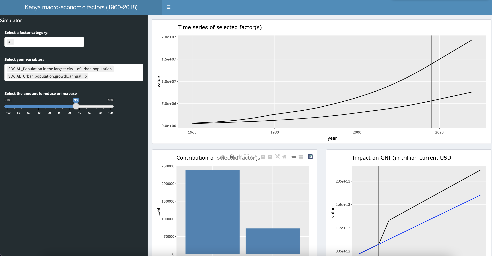

<h1>Macrokenya (1960-2018)</h1>
Macro-kenya is a quick R Shiny proof of concept built in May 2022. 
It aims to conceptualise the contributions of different social, economic and international factors to the Gross National Income of Kenya. 

The data is sourced from the Kenyan data portal: https://kenya.opendataforafrica.org. 

example:

<h3>The approach</h3>
Over 5,000 features have been sourced from the Kenyan open-data portal. Feature selection is operated via Lasso regression which automatically discards useless or redundant variables. Basic forecasting techniques have been used such as ARIMA and Holt-WInter. 

There is room for further improvement, such as analysis of collinearity etc. However, the goal of the POC was to show a quick demonstrable prototype. 

<h3>Setup </h3>
Go in the root directory and run: 
rscript r/scripts/setup.R

<h3>Run Shiny</h3>
Go in the root directory and run: 
rscript run.R

You can access the web-app on the url: http://127.0.0.1:8080

